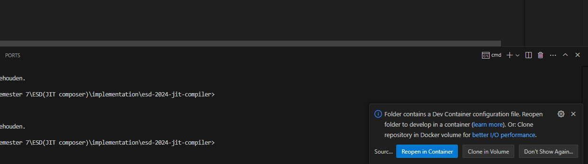

Open in browser for readability: https://github.com/sebivenlo/esd-2024-jit-compiler

# Welcome to the JIT-Compiler Workshop

**Important**: Before starting the challenges, we need to create the Docker container that includes all the necessary programming languages and dependencies.

Click pop-up in VS Code: Folder contains a Dev Container configuration file. **Reopen in container.**. See image below

## Challenges
1. [Manually compile Java program and view bytecode (to show how compilation work)](/implementation/JAVA/README.md)
2. [See interpreter error in Python: Division by zero](/implementation/Python/exercise_3/README.md)
3. [See compiler error in C](/implementation/C/README.md)
4. run Python with CPython and PyPy (to show with or without JIT)
5. [ALDA Sorting exercise. Testing different Sorts with JIT Compiler](/implementation/JavaScript/README.md)
<!-- 6. run Python 3.13 (with JIT flag) (TODO: install Python 3.13 via downloading binaries because it is not in apt-get yet) -->

:speech_balloon: Please ask Jorge or Thijs for help if you encounter a problem.

Go to documentation to see the complete work: [All documention about JIT Compiler](./documents/README.md)

Go to project management to see how we divided the tasks: [Project Management](./project_management/README.md)

<!-- You found me -->