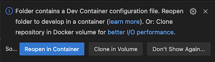

Open in browser for readability: https://github.com/sebivenlo/esd-2024-jit-compiler

# JIT-Compiler Workshop
## Docker
The Docker container includes all the necessary programming languages and dependencies.

Click pop-up in VS Code: Folder contains a Dev Container configuration file. **Reopen in container.**. See image below. Missed it? Open Command Palette > 'Dev Containers: Reopen in Container'.

## Challenges
1. Interpreter vs Compiler

   a. [Compiler error in C](/workshop/c/README.md)

   b. [Runtime error in Python: Division by zero](/workshop/python/runtime_error/README.md)

2. Generate bytecode

   a. [Java Compiler (javac)](/workshop/java/README.md)

   b. [CPython Interpreter](/workshop/python/bytecode_conversion/README.md)

3. [Run Python with CPython (reference implementation) and PyPy (with JIT)](/workshop/python/jit_vs_jitless/)
4. [ALDA Sorting exercise (JavaScript). Testing different Sorts with (and without) JIT Compiler](/workshop/javascript/README.md)
5. [Bonus: LLVM Compiler](/workshop/python/llvm/README.md)
6. [Superbonus: JavaScript: V8 Tick profiling](/workshop/javascript/tick_profiling_v8.md)

---

:speech_balloon: Please ask **Jorge** or **Thijs** for help if you encounter a problem.

---

## Links
- [Documentation about JIT Compiler](./documents/README.md)
- [Workshop approach](./documents/approach.md)
- [Project Management](./project_management/README.md)

<!--  -->

<!-- You found me -->