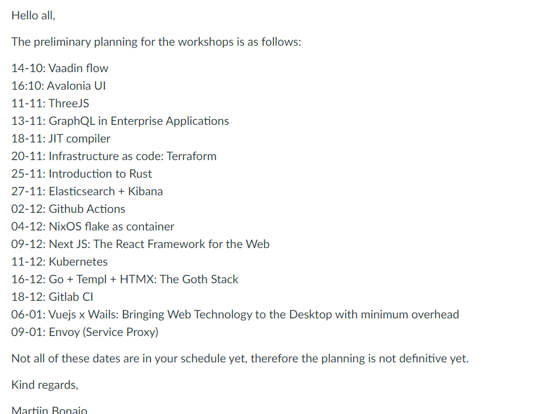

Go back - [root](../)

# Project Management

This part will containt all the work informations such as methodologies, delivares, deadlines, etc.

## Module description

The module description can be found in this link: [module description](./images/md_esd.pdf). The module description contains all needed information of this module.

## Agile methodology

For this course we are going to use a variation of Agile which only covers the springs and the small tasks

## Project board

We are going to use a project board which consists on 3 blocks(Backlog, In progress and Done) to keep in track all our process and to see on which tasks we are currently working on.

## Assesment scheduler

This is the schedule of all students workshop, the duration is of 90 minutes where the students should present their research work and give the audience a few code examples where they also can test the work of the students. 

