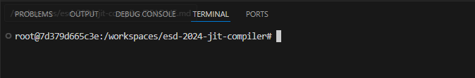
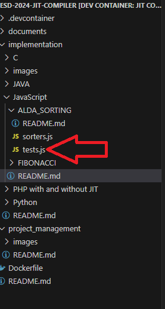

# Welcome to the JavaScript Challenge

## Overview
In this challenge, you will explore the performance of different algorithms in JavaScript. There are currently two exercises:

1. **ALDA Sorting**: This exercise includes three sorting algorithms and demonstrates how their performance varies with the JIT (Just-In-Time) compiler. For more information, visit the [ALDA Sorting explanation](./ALDA_SORTING/README.md).

2. **Fibonacci Sequence**: This exercise includes two implementations of the Fibonacci sequence—one using recursion and the other using an iterative loop. The main goal is to observe the performance differences when using JIT with recursive versus iterative functions. For more information, visit the [Fibonacci explanation](./FIBONACCI/README.md).

---
**Important**: Be sure you are located in the root folder, see image below



## Exercise 1: ALDA Sorting

### Steps to Run ALDA Sorting with JIT


1. **Run the tests with JIT enabled** by executing the following command:
   ```bash
   node workshop/javascript/ALDA_SORTING/tests.js

2. **Open sort tests file** 
Open the tests.js file located in workshop/javascript/ALDA_SORTING/. See image below



3. **Change the size of the generated Array** 
Once you opened the file change, change line 12 from const size = 100000; to const size = 10000;
This will prevent that the code without jit doesn't take more that a minute to finish

4. **Run the tests without JIT** by executing the following command:
   ```bash
   NODE_OPTIONS="--jitless" node workshop/javascript/ALDA_SORTING/tests.js

5. **See difference between JIT and Without JIT**

## Exercise 2: Fibonacci Sequence

The Fibonacci process is a sequence where each number is the sum of the two preceding ones, typically starting with 0 and 1. This sequence is defined as:

F(0)=0 F(1)=1 F(n)=F(n−1)+F(n−2) for 𝑛 ≥ 2 n≥2


So, the series starts as: 0, 1, 1, 2, 3, 5, 8, 13, 21, 34, and so on.

### Steps to Run the Fibonacci Exercise

<!-- 1. **Run the iterative Fibonacci function with JIT**  
   Execute the following command to run the iterative version with JIT enabled:
   ```bash
   node workshop/javascript/FIBONACCI/fibonacci-iterative.js


2. **Run the iterative Fibonacci function without JIT**  
   Execute the following command to run the iterative version without JIT:
   ```bash
   NODE_OPTIONS="--jitless" node workshop/javascript/FIBONACCI/fibonacci-iterative.js
 -->

1. **Run the recursive Fibonacci function with JIT**  
   Execute the following command to run the recursive Fibonacci function with JIT:
   ```bash
   node workshop/javascript/FIBONACCI/fibonacci.js

2. **Run the recursive Fibonacci function without JIT**  
   Execute the following command to run the recursive version without JIT:
   ```bash
   NODE_OPTIONS="--jitless" node workshop/javascript/FIBONACCI/fibonacci.js

3. **Observe the performance differences**
Compare the execution times of the iterative and recursive functions with and without JIT enabled. Note any significant differences in performance.


