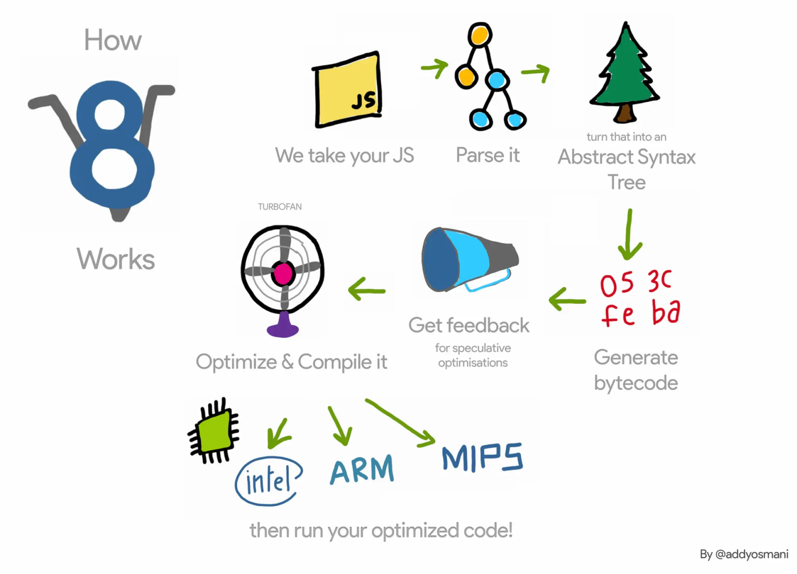

## Tick profiling V8

JIT is all about performance. To learn more about why a script performs good or bad, you have to analyse. We do this with V8 Tick profiling.

### FIBONACCI
    node --prof fibonacci.js

This creates a isolate-xxxxxxxxxxxxx-v8.log file

    node --prof-process isolate-xxxxxxxxxxxxx-v8.log > profile.txt

Open profile.txt and see in summary that **Javascript** has the most ticks

### ALDA_SORTING

    node --prof sorters.js

This creates a isolate-xxxxxxxxxxxxx-v8.log file

    node --prof-process isolate-xxxxxxxxxxxxx-v8.log > profile.txt

Open profile.txt and see in summary that **C++** has the most ticks

## Question
Why the ALDA_SORTING is more C++ intensive, and the FIBONACCI is more Javascript intensive?

Source: [V8 JavaScript Engine Improvement](https://www.freshcodeit.com/blog/v8-javascript-engine-improvement)